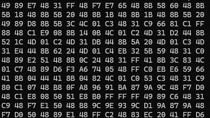

# Mirage

Mirage is a PoC memory evasion technique that relies on a vulnerable VBS enclave to hide shellcode within VTL1.
For additional information please refer to our blogpost:
https://akamai.com/blog/security-research/

## Operation
The code performs the following steps:
1. Loads a vulnerable version of the "prefs_enclave_x64.dll" enclave
2. Call the vulnerable "SealSettings" function to store shellcode and a "cleanup buffer" inside the enclave
3. Allocate an empty RWX buffer in VTL0
4. Call the vulnerable "UnsealSettings" function to write the shellcode from the enclave into the VTL0 executable buffer
5. Jump to shellcode
6. When the shellcode returns, call the vulnerable "UnsealSettings" function to overwrite the VTL0 shellcode buffer with the cleanup buffer
7. Sleep for 5 seconds and repeat from step 4

*This implementation is very simplistic and is only meant to demonstrate the concept - adjustments are certainly required to weaponize it.*

## Credits

Alex Gough of the Chrome Security Team for the POC exploit for CVE-2023-36880:
https://github.com/google/security-research/security/advisories/GHSA-wwr4-v5mr-3x9w

## License
Copyright 2025 Akamai Technologies Inc.

Licensed under the Apache License, Version 2.0 (the "License");
you may not use this file except in compliance with the License.
You may obtain a copy of the License at

    http://www.apache.org/licenses/LICENSE-2.0

Unless required by applicable law or agreed to in writing, software
distributed under the License is distributed on an "AS IS" BASIS,
WITHOUT WARRANTIES OR CONDITIONS OF ANY KIND, either express or implied.
See the License for the specific language governing permissions and
limitations under the License.

